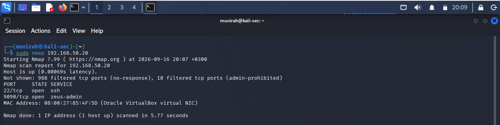
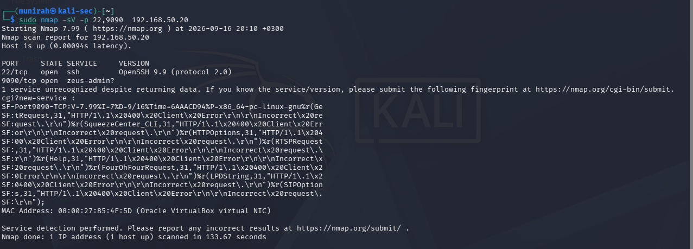
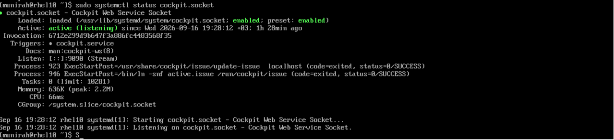
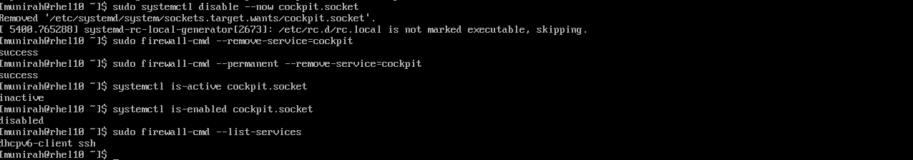
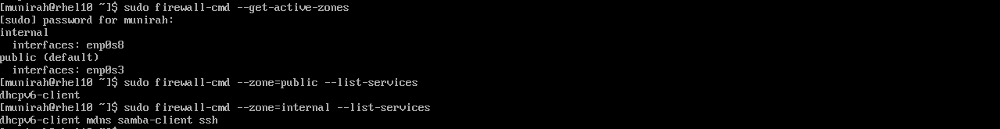
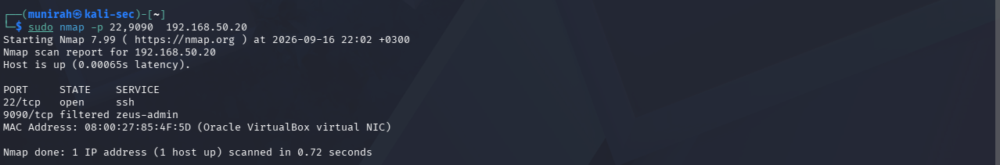

# 🛡️ Linux Server Security Hardening Lab

> A hands-on Linux security assessment and hardening lab using Kali Linux and Red Hat Enterprise Linux.

This project demonstrates a practical security assessment and hardening process for a RHEL server. The lab focuses on discovering exposed services, investigating their purpose, reducing unnecessary attack surface, applying firewall segmentation, and verifying the security changes from an external machine.

---

## 🧪 Lab Environment

| Component | Role |
|---|---|
| Kali Linux | Security assessment machine |
| Red Hat Enterprise Linux 10.2 | Target server |
| Oracle VirtualBox | Virtualization platform |
| Nmap | Network scanning and service detection |
| firewalld | Firewall configuration |
| systemd | Service and socket management |

---

## 🌐 Network Architecture

```text
                 Internet
                    │
                  NAT
                    │
        ┌───────────┴───────────┐
        │                       │
   Kali Linux              RHEL Server
  192.168.50.10            192.168.50.20
        │                       │
        └──── sec-lab ──────────┘
           Internal Network
```

Both virtual machines use:

- A NAT adapter for Internet access
- An Internal Network named `sec-lab` for isolated communication between Kali Linux and RHEL

---

## 🔍 Baseline Assessment

An initial Nmap scan was performed from Kali Linux against the RHEL server to identify exposed services.

The scan identified two open TCP ports:

- `22/tcp` - SSH
- `9090/tcp` - Web administration service



---

## 🔎 Service Detection

A service version scan was performed to identify the software running on the exposed ports.

The results identified:

- OpenSSH 9.9 on TCP/22
- An active service on TCP/9090 that required further investigation



---

## ⚠️ Finding 1 - Unnecessary Cockpit Exposure

Further investigation on the RHEL server confirmed that the Cockpit web console was enabled and listening on TCP/9090.

Because Cockpit had only been used previously for training and was no longer required, leaving it enabled created unnecessary network exposure.



### Hardening Action

The Cockpit socket was disabled and Cockpit access was removed from the firewall configuration.

The change was then verified by confirming that the socket was inactive and disabled.



---

## 🔐 Finding 2 - Firewall Segmentation

Initially, both RHEL network interfaces were assigned to the same firewall zone.

The firewall configuration was changed to separate the interfaces based on their purpose:

| Interface | Zone | Purpose |
|---|---|---|
| `enp0s3` | `public` | Internet access |
| `enp0s8` | `internal` | Isolated security lab network |

SSH access was removed from the public zone and kept available through the internal network.



---

## ✅ Final Verification

A final Nmap scan was performed from Kali Linux after the hardening changes.

The results confirmed that:

- SSH remained accessible on TCP/22 through the internal lab network
- TCP/9090 was filtered and no longer exposed



---

## 📊 Before vs After

| Security Area | Before Hardening | After Hardening |
|---|---|---|
| SSH | Open | Restricted to internal network |
| Cockpit / TCP 9090 | Open | Filtered / not exposed |
| Firewall zones | Both interfaces in public | Public and internal zones separated |
| Attack surface | Larger | Reduced |
| Administrative access | Broad network exposure | Limited to required network |

---

## 🧠 Skills Practiced

- Linux system administration
- Network scanning with Nmap
- Service and version enumeration
- systemd service and socket management
- firewalld configuration
- Firewall zone segmentation
- Attack surface reduction
- Security verification and validation
- Virtual machine networking
- Troubleshooting network and service configurations

---

## 💡 What I Learned

This lab helped me understand how a security assessment can be performed from an external machine and how scan results can be verified directly on the target server.

I learned that an open port does not automatically mean a vulnerability. The exposed service must first be identified, its purpose reviewed, and then a decision should be made based on whether the service is actually required.

I also learned how firewall zones can be used to separate network interfaces and limit administrative access to the network where it is needed.

Most importantly, the lab demonstrated a complete security workflow:

**Discover → Investigate → Harden → Verify**
